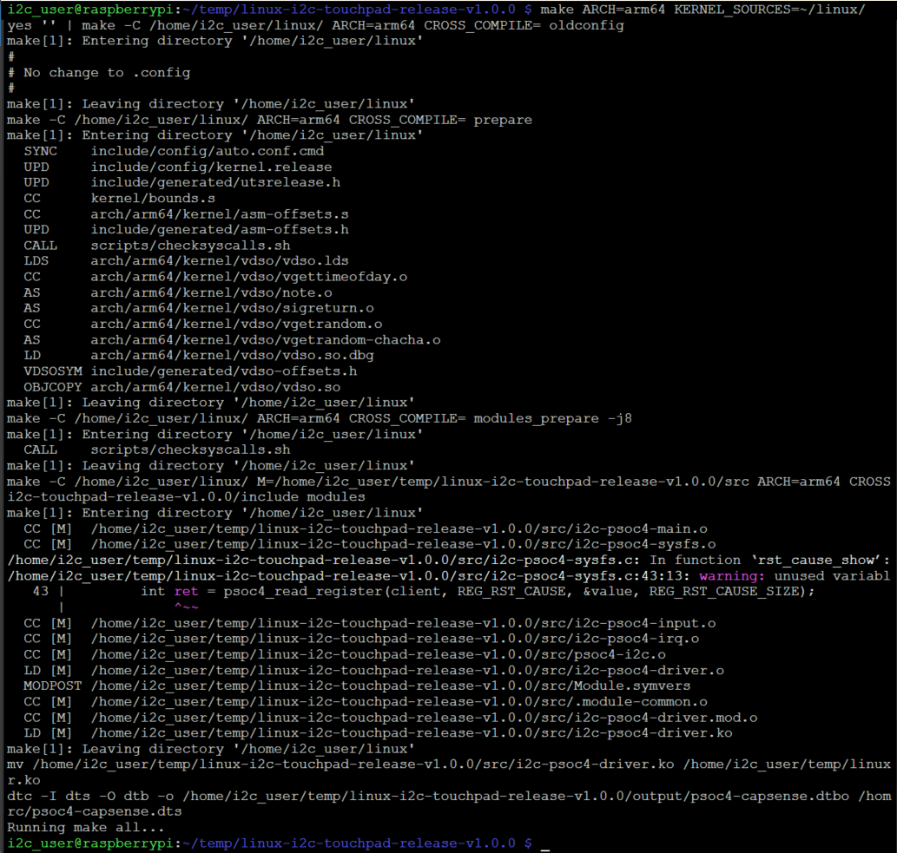

# How to Build the Linux I2C Driver

This document provides step-by-step instructions to build the Linux I2C driver for your kernel.

## Prerequisites

Before building the driver, ensure the following dependencies and tools are available:

1. **Linux Kernel Sources**:
   - The kernel sources for the target system must be available. These are required to build the driver against the correct kernel version.

2. **GNU Make**:
   - Ensure `make` is installed on your system.

3. **GCC Compiler**:
   - If building directly on the target system, ensure the native GCC compiler is installed.

4. **Cross-Compiler** (Optional):
   - If cross-compiling, a GCC cross-compiler for the target architecture is required.
   - Set the `CROSS_COMPILE` environment variable to the prefix of the cross-compiler (e.g., `aarch64-none-linux-gnu-`).

5. **Device Tree Compiler (DTC)**:
   - The `dtc` tool is required to compile the device tree source (`.dts`) files into binary overlays (`.dtbo`).
   - Install it using your package manager (e.g., `sudo apt install device-tree-compiler` on Ubuntu).

6. **Compatible PSOC™4 code example**:
   - [PSOC™ 4: MSCLP Low Power Smart Glass CSX Touchpad](https://github.com/Infineon/mtb-example-psoc4-msclp-smart-glass-touchpad/)

## Required Packages

Install the following packages before building:

```bash
sudo apt-get install -y bc bison flex libssl-dev make wget libncurses-dev device-tree-compiler build-essential git
```

- `bc`
- `bison`
- `flex`
- `libssl-dev`
- `make`
- `wget`
- `libncurses-dev`
- `device-tree-compiler`
- `build-essential`
- `git`

To check if all required packages are installed, run:

```bash
dpkg -l bc bison flex libssl-dev make wget libncurses-dev device-tree-compiler build-essential git
```
If any package is not installed, its status will be "un" (not installed). If installed, the status will be "ii" (installed).

 

## Custom configuration

### Device Tree configuration
Before building the driver, you may need to adjust the I2C device address or interrupt GPIO pin in the Device Tree source file (`psoc4-capsense.dts`).

Example fragment:
```dts
psoc4_capsense@D {
    compatible = "infineon,psoc4-capsense";
    reg = <0x0D>;                // I2C address (change as needed)
    interrupt-parent = <&gpio>;
    interrupts = <17 0x02>;      // GPIO pin and trigger type (change as needed)
    status = "okay";
    ...
};
```
- `reg`: I2C address of the device. You should also change the address in the node name, e.g. `psoc4_capsense@D`, where `D` is the hexadecimal I2C address.
- `interrupts`: GPIO pin number and trigger type for interrupt.

Edit these values to match your hardware setup before building the overlay and the driver.

### Input Event Mapping Configuration
You can customize the mapping of Linux input key events to touchpad gestures in the file `include/input-report-config.h`.

For example, you can change which Linux key code is reported for each gesture:
```c
#define GEST_SINGLE_CLICK_KEY   KEY_PLAYPAUSE
#define GEST_DOUBLE_CLICK_KEY   KEY_SHUFFLE
#define GEST_SWIPE_UP_KEY       KEY_VOLUMEUP
#define GEST_SWIPE_DOWN_KEY     KEY_VOLUMEDOWN
#define GEST_SWIPE_RIGHT_KEY    KEY_REWIND
#define GEST_SWIPE_LEFT_KEY     KEY_FASTFORWARD
#define GEST_TOUCHDOWN_KEY      BTN_TOUCH
#define GEST_LIFTOFF_KEY        BTN_TOUCH
```
Edit these defines to match your application requirements or preferred key codes.

## Build Steps

Follow these steps to build the driver:

Navigate to the root directory of the driver source code and run:
```bash
make ARCH=<target-architecture> KERNEL_SOURCES=<path-to-kernel-sources> # Native build
or
make ARCH=<target-architecture> KERNEL_SOURCES=<path-to-kernel-sources> CROSS_COMPILE=<path-to-cross-compiler-prefix> # Cross-Compilation
```

For example:
```bash
make ARCH=arm64 KERNEL_SOURCES=~/linux # Native build
or
make ARCH=arm64 KERNEL_SOURCES=~/linux CROSS_COMPILE=/usr/bin/aarch64-none-linux-gnu- # Cross-Compilation
```

### Build Only the Driver Module

If you want to build only the driver module without preparing the kernel sources, you can directly invoke the `build-driver` target:
```bash
make build-driver
```

This will skip the kernel source preparation steps and compile only the driver module. Ensure that the kernel sources are already prepared before using this option.

### Build Only the Device Tree Overlay

If you want to build only the device tree overlay, you can use the `dt` target:
```bash
make dt
```

This will compile the `psoc4-capsense.dts` file into a `psoc4-capsense.dtbo` file and place it in the `output/` directory.

### Clean the Build Artifacts

To clean the build artifacts, run:
```bash
make clean
```

### Output

After a successful build, the compiled kernel module (`i2c-psoc4-driver.ko`) and the device tree overlay (`psoc4-capsense.dtbo`) file will be located in the `output/` directory.

## Quick Start Guide for Raspberry Pi 4

This Quick Start Guide is intended for Raspberry Pi 4 platform.

> **Note:** Before loading the driver, make sure the I2C interface is enabled: enable I2C on the Raspberry Pi via `sudo raspi-config` (Interface Options → I2C → Yes), then reboot the device.

### 1. Update Raspberry Pi OS and Download Kernel Sources

Before building the driver, update your Raspberry Pi OS to the latest version and download the matching kernel sources:

1. **Update Raspberry Pi OS:**
   ```bash
   sudo rpi-update
   sudo reboot
   ```

2. **Check your current kernel version:**
   ```bash
   uname -r
   ```
   This will print something like `6.12.43-v8+`.

3. **Download the matching kernel sources from GitHub:**
   ```bash
   cd ~
   git clone --depth=1 --branch <kernel_branch_name> https://github.com/raspberrypi/linux.git
   ```
   Replace `<kernel_branch_name>` with the branch name that matches your kernel version (for example, `rpi-6.12.y`).
   You can find the correct branch name by checking the [Raspberry Pi Linux GitHub branches](https://github.com/raspberrypi/linux/branches).

### 2. Prepare the Kernel Sources

> **Note:** To build the module, the module and kernel source directories must have permissions of at least 755. The owner and group of these directories should be set to your current user and group. 

Prepare the kernel sources according to your Raspberry Pi:

**For Raspberry Pi 4:**
```bash
cd ~/linux
KERNEL=kernel8
make bcm2711_defconfig
```

This step sets up the default kernel configuration for your board. The `KERNEL` variable is used for further build steps and should match your hardware.

 

After configuring the kernel sources, you also need to download the matching `Module.symvers` file from GitHub. This file is required for building external kernel modules.

**For Raspberry Pi 4:**
```bash
wget https://github.com/raspberrypi/firmware/raw/master/extra/Module8.symvers -O Module.symvers
```

Place the downloaded `Module.symvers` file in your kernel sources directory (`~/linux/Module.symvers`).


> Without the correct `Module.symvers`, the driver may not link properly to kernel symbols.

### 3. Build the Driver and Device Tree Overlay

Navigate to the root directory of the driver source code and run:
```bash
make ARCH=arm64 KERNEL_SOURCES=~/linux
```

 

This will invoke the top-level `Makefile` and build both the driver and the device tree overlay. The compiled kernel module (`i2c-psoc4-driver.ko`) and the device tree overlay (`psoc4-capsense.dtbo`) will be placed in the `output/` directory.


### 4. Apply the Device Tree Overlay Temporarily
To apply the overlay without rebooting, use the following command:
```bash
sudo dtoverlay <path_to_your_dir>/output/psoc4-capsense.dtbo
```

### 5. Loading the Driver
To load the driver module (`i2c-psoc4-driver.ko`) located in your output directory:
```bash
sudo insmod <path_to_your_dir>/output/i2c-psoc4-driver.ko
```

### Steps to Load Driver:

#### 1. Removing the Driver
To load the driver module (`i2c-psoc4-driver.ko`) located in your output directory:
```bash
sudo rmmod i2c-psoc4-driver
```

#### 2. Remove the Overlay
To remove the overlay after it has been applied:
```bash
sudo dtoverlay -r psoc4-capsense
```

#### 3. Load kernel module and apply device tree overlay permanently upon boot:


To automatically load the kernel module and apply the device tree overlay at boot:

1. **Device Tree Overlay:**
   - Copy the overlay file to `/boot/overlays/`:
     ```bash
     sudo cp output/psoc4-capsense.dtbo /boot/overlays/
     ```
   - Add the following line at the end of the file `/boot/firmware/config.txt`:
     ```
     dtoverlay=psoc4-capsense
     ```

2. **Kernel Module:**
   - Copy the driver module to a standard modules directory, e.g. `/lib/modules/$(uname -r)/kernel/`:
     ```bash
     sudo cp output/i2c-psoc4-driver.ko /lib/modules/$(uname -r)/kernel/
     sudo depmod -a
     ```
   - Add the module name (without .ko extension) to `/etc/modules` to load it at boot:
     ```
     echo i2c-psoc4-driver | sudo tee -a /etc/modules
     ```

After these steps, both the overlay and the driver will be loaded automatically on system startup.
Reboot system to apply changes:
```bash
    sudo reboot
```

> **Note:** Before booting up, ensure that the PSOC™4 device is physically connected to the I2C lines. The driver and overlay require the device to be present on the bus during system startup for proper initialization.

## Notes

- Ensure the kernel sources match the kernel version of the target system.
- If you encounter issues, verify that the `CROSS_COMPILE`, `ARCH`, and `KERNEL_SOURCES` variables are set correctly.
- Use `dmesg` to check for any kernel messages related to the driver after loading it.

---
© 2025, Cypress Semiconductor Corporation (an Infineon company) or an affiliate of Cypress Semiconductor Corporation.
