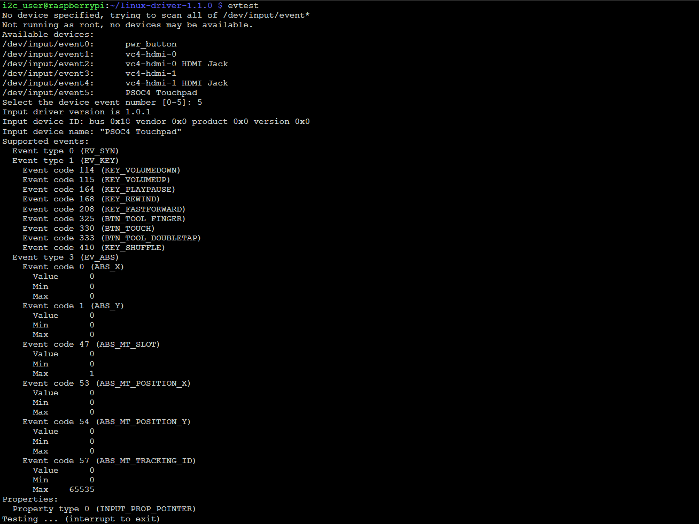
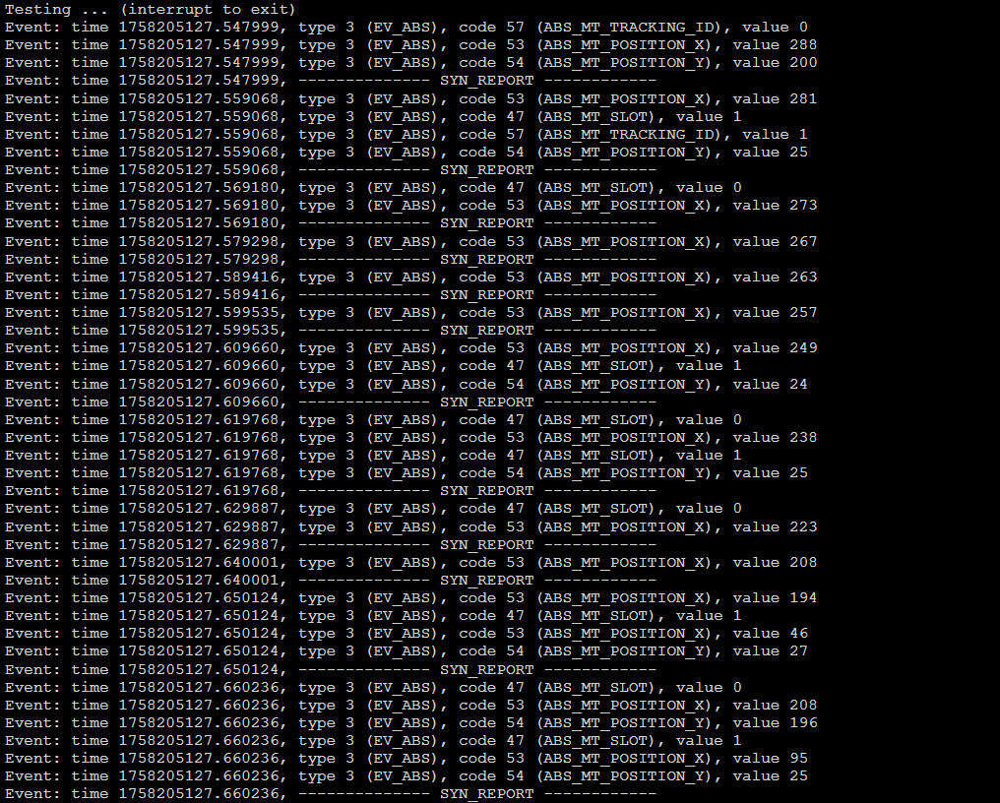
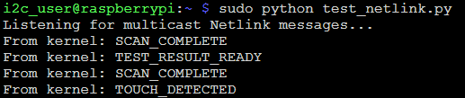

# Using the Linux I2C Touchpad Driver: A Step-by-Step Guide

> ⚠️ **Attention:** This driver was tested with Raspberry Pi 4 (RPi4) only and has not been tested with an I2C clock speed of 1 MHz.

> **Note:** Before booting up, ensure that the PSOC™4 device is physically connected to the I2C lines. The driver and overlay require the device to be present on the bus during system startup for proper initialization.

**Compatible PSOC™4 code example**:* [PSOC™ 4: MSCLP Low Power Smart Glass CSX Touchpad](https://github.com/Infineon/mtb-example-psoc4-msclp-smart-glass-touchpad/)

## Build Instructions
For detailed build instructions or build QSG for RPi, refer to the [HOW_TO_BUILD.md](HOW_TO_BUILD.md) file.

## Using Instructions

> **Note:** If you have not configured the device tree overlay and kernel module to be applied permanently on boot, follow step 1. Device Registration and 2. Loading and Unloading the Driver below. If the overlay and kernel module is configured to load automatically on boot, you can skip directly to step 3. Supported Sysfs Attributes.

### 1. Device Registration
The device is automatically registered when the driver is loaded, provided the corresponding device tree overlay (`psoc4-capsense.dtbo`) is applied.

#### Using the Device Tree Overlay

The `psoc4-capsense.dtbo` file is used to configure the device tree for the PSOC4 CapSense driver. Below are the options for using the `.dtbo` file:

#### 1.1. Apply the Overlay Temporarily
To apply the overlay without rebooting, use the following command:
```bash
sudo dtoverlay <path_to_your_dir>/output/psoc4-capsense.dtbo
```

#### 1.2. Remove the Overlay
To remove the overlay after it has been applied:
```bash
sudo dtoverlay -r psoc4-capsense
```

### 2. Loading and Unloading the Driver
To load the driver module (`i2c-psoc4-driver.ko`) located in your directory:
```bash
sudo insmod <path_to_your_dir>/output/i2c-psoc4-driver.ko
```

To unload the driver module:
```bash
sudo rmmod i2c-psoc4-driver
```

#### Checking Driver Logs
After loading or unloading the driver, you can check the kernel logs for messages related to the driver using the `dmesg` command.

### 3. Supported Sysfs Attributes
| Attribute          | Access Type | Description                                                                                     | Example Usage (Write / Read)                                                    | Option list
|---------------------|-------------|-------------------------------------------------------------------------------------------------|----------------------------------------------------------------------------------|------------------------------------------
| `fw_ver`           | Read-only   | Displays the firmware version of the device.                                                   | `cat /sys/bus/i2c/devices/i2c-1/psoc4-capsense/fw_ver`                          | N/A |
| `rst_cause`        | Read-only   | Displays the reset cause of the device.                                                        | `cat /sys/bus/i2c/devices/i2c-1/psoc4-capsense/rst_cause`                       | 0x01: WDT reset<br>0x08: Protection Fault<br>0x10: Software reset <br> 0x00: Voltage reset (XRES, BOD, or Normal POR) |
| `reset`            | Write-only  | Triggers a software reset.                                                                     | `sudo sh -c 'echo "1" > /sys/bus/i2c/devices/i2c-1/psoc4-capsense/reset'`      | 1 is the only valid option, as setting it to 1 simply triggers the execution of this action. |
| `save_capsense`    | Write-only  | Saves the CapSense configuration.                                                              | `sudo sh -c 'echo "1" > /sys/bus/i2c/devices/i2c-1/psoc4-capsense/save_capsense'` | 1 is the only valid option, as setting it to 1 simply triggers the execution of this action. |
| `restore_capsense` | Write-only  | Restores the CapSense configuration.                                                           | `sudo sh -c 'echo "1" > /sys/bus/i2c/devices/i2c-1/psoc4-capsense/restore_capsense'` | 1 is the only valid option, as setting it to 1 simply triggers the execution of this action. |
| `cp_test`          | Write-only  | Triggers a Cp Test.                                                                            | `sudo sh -c 'echo "1" > /sys/bus/i2c/devices/i2c-1/psoc4-capsense/cp_test'`    | 1 is the only valid option, as setting it to 1 simply triggers the execution of this action. |
| `short_test`       | Write-only  | Triggers a Short Test.                                                                         | `sudo sh -c 'echo "1" > /sys/bus/i2c/devices/i2c-1/psoc4-capsense/short_test'` | 1 is the only valid option, as setting it to 1 simply triggers the execution of this action. |
| `bootloader_jump`  | Write-only  | Triggers a jump to the bootloader.                                                             | `sudo sh -c 'echo "1" > /sys/bus/i2c/devices/i2c-1/psoc4-capsense/bootloader_jump'` | 1 is the only valid option, as setting it to 1 simply triggers the execution of this action. |
| `test_status`      | Read-only   | Displays the test status and shorted sensor ID if applicable.                                  | `cat /sys/bus/i2c/devices/i2c-1/psoc4-capsense/test_status`                     | Test status:<br>0x00: Success<br>0x01: Reserved<br>0x02: CAPSENSE™ hardware was busy<br>0x05: Test failed to complete<br>0x0F: Short detected (Short test only). Indicates a short on the Pin if TEST_STATUS = 0x0F. <br> To identify which specific pin is detected as short refer [3.1. Package Specific Pin Value for short_test](#31-pin-list-with-shorted_sns_id-values). |
| `int_src_en`       | Read/Write  | Enables or disables interrupt sources.                                                         | Write: `sudo sh -c 'echo "1F" > /sys/bus/i2c/devices/i2c-1/psoc4-capsense/int_src_en'`<br>Read: `cat /sys/bus/i2c/devices/i2c-1/psoc4-capsense/int_src_en` | 0x01: Scan Frame Result Ready<br>0x02: Touch Detected<br>0x04: Test Result Ready<br>0x08: Sensing App Running<br>0x10: Gesture Detected<br>0x20: Liftoff or touchdown detected<br>0x80: Application Error<br><br>Default: 0xBF (All Enabled) |
| `int_status`       | Read/Write  | Displays or clears interrupt status.                                                           | Write: `sudo sh -c 'echo "00" > /sys/bus/i2c/devices/i2c-1/psoc4-capsense/int_status'`<br>Read: `cat /sys/bus/i2c/devices/i2c-1/psoc4-capsense/int_status` | 0x00: No pending interrupts<br>0x01: Scan-Complete<br>0x02: Touch Detected<br>0x04: Test Result Ready<br>0x08: Sensing App Running<br>0x10: Gesture Detected<br>0x20: Liftoff or touchdown detected<br>0x80: Application Error<br><br>Default: 0x00 |
| `error_status`     | Read-only   | Displays the error status of the device.                                                      | `cat /sys/bus/i2c/devices/i2c-1/psoc4-capsense/error_status`                    | 0x00: No errors<br>0x01: Requested parameter is invalid<br>0x02: I2C Timeout Expired<br>0x04: CAPSENSE Auto-Calibration Failed |
| `scan_mode`        | Read-only   | Displays the current scan mode of the device.                                                  | `cat /sys/bus/i2c/devices/i2c-1/psoc4-capsense/scan_mode`                       | 0x00: Not scanning<br>0x01: Active scanning<br>0x02: Active-Low-Refresh (ALR) rate scanning<br>0x04: Wake-on-touch scanning<br> |
| `shield_en`        | Read/Write  | Enables or disables the shield.                                                               | Write: `sudo sh -c 'echo "01" > /sys/bus/i2c/devices/i2c-1/psoc4-capsense/shield_en'`<br>Read: `cat /sys/bus/i2c/devices/i2c-1/psoc4-capsense/shield_en` | 0x00: Disables the shield<br>0x01: Enables the shield<br><br>Default: 0x00 |
| `wear_det_en`      | Read/Write  | Enables or disables wear detection.                                                           | Write: `sudo sh -c 'echo "01" > /sys/bus/i2c/devices/i2c-1/psoc4-capsense/wear_det_en'`<br>Read: `cat /sys/bus/i2c/devices/i2c-1/psoc4-capsense/wear_det_en` | 0x00: None enabled<br>0x01: CSD0<br>0x02: CSD1<br>0x04: CSD2<br>0x08: CSD3<br>0x10: CSD4<br>0x20: CSD5<br><br>Default: 0x00 |
| `sns_auto_cal_en`  | Read/Write  | Enables or disables sensor auto-calibration.                                                  | Write: `sudo sh -c 'echo "01" > /sys/bus/i2c/devices/i2c-1/psoc4-capsense/sns_auto_cal_en'`<br>Read: `cat /sys/bus/i2c/devices/i2c-1/psoc4-capsense/sns_auto_cal_en` | 0x00: Auto-Calibration is Disabled<br>0x01: Auto-Calibration is Enabled<br><br>Default: 0x01 |
| `sns_filt_cfg`     | Read/Write  | Configures sensor filtering.                                                                   | Write: `sudo sh -c 'echo "1234" > /sys/bus/i2c/devices/i2c-1/psoc4-capsense/sns_filt_cfg'`<br>Read: `cat /sys/bus/i2c/devices/i2c-1/psoc4-capsense/sns_filt_cfg` | Bit 0: Median filter<br>Bit 1: Average filter<br>Bit 2: IIR filter<br>Bits 8-15: SW IIR Coefficient, if 0, SW IIR filter is not applied<br><br>Default: 0x0000 |
| `sns_ref_rate_act` | Read/Write  | Configures the refresh rate of the sensors in active mode.                                     | Write: `sudo sh -c 'echo "05" > /sys/bus/i2c/devices/i2c-1/psoc4-capsense/sns_ref_rate_act'`<br>Read: `cat /sys/bus/i2c/devices/i2c-1/psoc4-capsense/sns_ref_rate_act` | Max: 0xFF<br>Min: 0x01<br><br>Default: 0x3C |
| `sns_ref_rate_alr` | Read/Write  | Configures the refresh rate of the sensors in low-refresh mode.                                | Write: `sudo sh -c 'echo "06" > /sys/bus/i2c/devices/i2c-1/psoc4-capsense/sns_ref_rate_alr'`<br>Read: `cat /sys/bus/i2c/devices/i2c-1/psoc4-capsense/sns_ref_rate_alr` | Max: 0xFF<br>Min: 0x01<br><br>Default: 0x3C |
| `dfu_update`       | Read/Write  | Initiates a Device Firmware Update (DFU) process using the specified firmware file path. The read operation shows the status of the last DFU attempt ("Success" or "Failure"). | Write: `sudo sh -c 'echo "<path_to_firmware>/firmware.cyacd" > /sys/bus/i2c/devices/i2c-1/psoc4-capsense/dfu_update'`<br>Read: `cat /sys/bus/i2c/devices/i2c-1/psoc4-capsense/dfu_update` | Write: absolute path to firmware file (max length: PATH_MAX).<br>Read: "Success" or "Failure" |

> **Note:** The `sudo sh -c` command is used here because writing to sysfs attributes typically requires elevated permissions. Directly using `echo "1F" > /sys/bus/i2c/devices/i2c-1/psoc4-capsense/int_src_en` would fail due to permission restrictions, as the redirection (`>`) is handled by the shell, which may not have the necessary privileges. The `sudo sh -c` ensures that both the `echo` command and the redirection are executed with root permissions.

> **Note:** The following attributes are now available only via debugfs (not sysfs): `touch0_pos`, `touch1_pos`, `num_touch`, `sns_raw`, `sns_bsln`, `sns_cp_measure`.

#### 3.1. Package Specific Pin Value for short_test

| 16-QFN |      | 24-QFN |      | 25-CSP |      |
|--------|------|--------|------|--------|------|
| <b>Value</b>    | <b>Name</b> | <b>Value</b>    | <b>Name</b> | <b>Value</b>    | <b>Name</b> |
| 0x000001      | P0.0 | 0x000001     | P0.0 | 0x000001     | P0.0 |
| 0x000002     | P0.1 | 0x000002     | P0.1 | 0x000002     | P0.1 |
| –      | –    | 0x000004     | P0.2 | 0x000004     | P0.2 |
| –      | –    | 0x000008     | P0.3 | 0x000008     | P0.3 |
| 0x000004     | P0.4 | 0x000010     | P0.4 | 0x000010     | P0.4 |
| –      | –    | –      | –    | 0x000020     | P0.5 |
| –      | –    | 0x000020     | P1.0 | 0x000040     | P1.0 |
| –      | –    | 0x000040     | P2.0 | 0x000080     | P2.0 |
| –      | –    | 0x000080      | P2.1 | 0x000100     | P2.1 |
| 0x000008      | P2.2 | 0x000100      | P2.2 | 0x000200     | P2.2 |
| 0x000010      | P2.3 | 0x000200      | P2.3 | 0x000400     | P2.3 |
| 0x000020      | P2.4 | 0x000400      | P2.4 | 0x000800     | P2.4 |
| 0x000040      | P2.5 | 0x000800      | P2.5 | 0x001000     | P2.5 |
| –      | –    | 0x001000      | P3.0 | 0x002000     | P3.0 |
| –      | –    | 0x002000      | P3.0 | 0x004000     | P3.1 |
| 0x000080      | P3.2 | 0x004000      | P3.2 | 0x008000     | P3.2 |
| –      | –    | 0x008000      | P3.3 | 0x010000     | P3.3 |
| –      | –    | 0x010000      | P4.0 | 0x020000     | P4.0 |
| 0x000100      | P4.2 | 0x020000     | P4.1 | 0x040000     | P4.1 |
| 0x000200      | P4.3 | 0x040000     | P4.2 | 0x080000     | P4.2 |
|        |      | 0x080000     | P4.3 | 0x100000     | P4.3 |

### 4. DebugFS Attributes

After loading the driver, the following debug/diagnostic attributes are available under `/sys/kernel/debug/psoc4_capsense/`:

| Attribute         | Access Type | Description                                  | Example Usage |
|-------------------|-------------|----------------------------------------------|--------------|
| `touch0_pos`      | Read-only   | Position of the first touch point (x, y, z)  | `cat /sys/kernel/debug/psoc4_capsense/touch0_pos` |
| `touch1_pos`      | Read-only   | Position of the second touch point (x, y, z) | `cat /sys/kernel/debug/psoc4_capsense/touch1_pos` |
| `num_touch`       | Read-only   | Number of detected touches                   | `cat /sys/kernel/debug/psoc4_capsense/num_touch` |
| `sns_raw`         | Read-only   | Raw counts of enabled sensors                | `cat /sys/kernel/debug/psoc4_capsense/sns_raw` |
| `sns_bsln`        | Read-only   | Baseline values of enabled sensors           | `cat /sys/kernel/debug/psoc4_capsense/sns_bsln` |
| `sns_cp_measure`  | Read-only   | Capacitance measurements (in fF)             | `cat /sys/kernel/debug/psoc4_capsense/sns_cp_measure` |
| `gestures_raw`    | Read-only   | Raw gesture bitmask (hex)                    | `cat /sys/kernel/debug/psoc4_capsense/gestures_raw` |
| `num_sns`         | Read-only   | Number of enabled sensors                    | `cat /sys/kernel/debug/psoc4_capsense/num_sns` |

### 5. Linux input subsystem integration
The driver integrates with the Linux input subsystem and registers an input device named `PSOC4 Touchpad`. Touch and gesture events are reported to user space via standard input event interfaces, making the device compatible with existing Linux tools and applications (such as `evtest`, `libinput`, and graphical environments).

#### Touch Data Reporting
- Supports up to 2 simultaneous touch points (multi-touch).
- Each touch point reports X, Y, and Z (pressure) coordinates.
- The driver uses multi-touch (ABS_MT_POSITION_X, ABS_MT_POSITION_Y) axes.
- You can enable legacy (ABS_X, ABS_Y) by adding `REPORT_LEGACY_COORDS` to the `BUILD_OPTIONS` variable in your Makefile (or passing it via command line). This will define the feature at build time.
- You can enable ABS_PRESSURE and ABS_MT_PRESSURE by adding `REPORT_PRESSURE` to the `BUILD_OPTIONS` variable in your Makefile (or passing it via command line). This will define the feature at build time.
```Makefile
BUILD_OPTIONS += REPORT_LEGACY_COORDS
BUILD_OPTIONS += REPORT_PRESSURE
```

#### Gesture Event Reporting
- Single and double tap gestures are mapped to standard Linux key events (e.g., `KEY_PLAYPAUSE`, `KEY_SHUFFLE`).
- Swipe/flick gestures in all four directions are mapped to key events (e.g., `KEY_VOLUMEUP`, `KEY_VOLUMEDOWN`, `KEY_REWIND`, `KEY_FASTFORWARD`).
- Touchdown and liftoff are mapped to `BTN_TOUCH` events.
- All gesture events are reported instantly to the input subsystem, allowing user-space applications to react accordingly.

> **Note:** The Linux key codes used for gesture events (e.g., `KEY_PLAYPAUSE`, `KEY_SHUFFLE`, `KEY_VOLUMEUP`, etc.) are defined in `input-report-config.h` and may be remapped as needed for your application.

> **Note:** The Touchdown and liftoff events can be controlled via mutually exclusive build options in `Makefile`:
> - `BUILD_OPTIONS += TOUCHDOWN_LIFTOFF_ON_GESTURE`: touchdown/liftoff events are generated immediately after touchdown/liftoff are detected as gestures.
> - `BUILD_OPTIONS += TOUCHDOWN_LIFTOFF_ON_IRQ`: touchdown/liftoff events are generated after touchdown/liftoff interrupt is received.
> <br><br>Only one of these options should be enabled at a time.

#### Example: Testing with evtest

To observe touch and gesture events, use the `evtest` utility:

```bash
sudo apt update
sduo apt install evtest
```

```bash
sudo evtest
```
Select the `PSOC4 Touchpad` device from the list and interact with the touchpad to see reported events.




### 6. Netlink event notifications
The driver sends event notifications (interrupts) to user space via a netlink socket. This allows user-space applications to receive asynchronous notifications about important device events.

**Netlink protocol number:** `31` (must match `NETLINK_USER_TYPE` in the driver)

**Netlink group:** `1` (must match `NETLINK_GROUP` in the driver)

**Events sent via netlink:**
- SCAN_COMPLETE — scan complete
- TOUCH_DETECTED — touch detected
- GESTURE_DETECTED — gesture detected
- TEST_RESULT_READY — test result ready
- SENSING_RUNNING — sensing app running
- LIFTOFF_TOUCHDOWN_DETECTED - touchdown/liftoff on irq detected
- APP_ERROR — application error

**How to subscribe to netlink events:**
1. Open a netlink socket with protocol 31 (`NETLINK_USER_TYPE`).
2. Connect socket to group 1 (`NETLINK_GROUP`)
3. The driver will then send text messages for each event.

> **Note:** Netlink is used for notifications only, not for device control. For event details, use sysfs/debugfs or the input interface.

#### Example: Testing Netlink Events from User Space

You can use a simple Python script to subscribe and receive netlink events from the driver:

Create a file `test_netlink.py` with the following content:
```python
import socket
import struct

NETLINK_USER = 31
NETLINK_GROUP = 1

sock = socket.socket(socket.AF_NETLINK, socket.SOCK_RAW, NETLINK_USER)

sock.bind((0, NETLINK_GROUP))

print("Listening for multicast Netlink messages...")

while True:
    data, (pid, groups) = sock.recvfrom(65535)
    # netlink header has 16 byte, payload after them
    # nlmsg_len, nlmsg_type, nlmsg_flags, nlmsg_seq, nlmsg_pid
    nlmsg_len, nlmsg_type, nlmsg_flags, nlmsg_seq, nlmsg_pid = struct.unpack("IHHII", data[:16])
    payload = data[16:nlmsg_len]  # first nlmsg_len bytes - it's packet
    print("From kernel:", payload.decode(errors="ignore"))

```

Run the script:
```bash
sudo python3 test_netlink.py
```

Now, when the driver sends netlink events (e.g., touch, gesture, scan complete), you will see them printed in the terminal:



> **Note:** You can also use C or other languages to work with netlink sockets. The key steps are: open a netlink socket with protocol 31, send any message to register, and read incoming messages.

---
© 2025, Infineon Technologies AG, or an affiliate of Infineon Technologies AG. All rights reserved.
